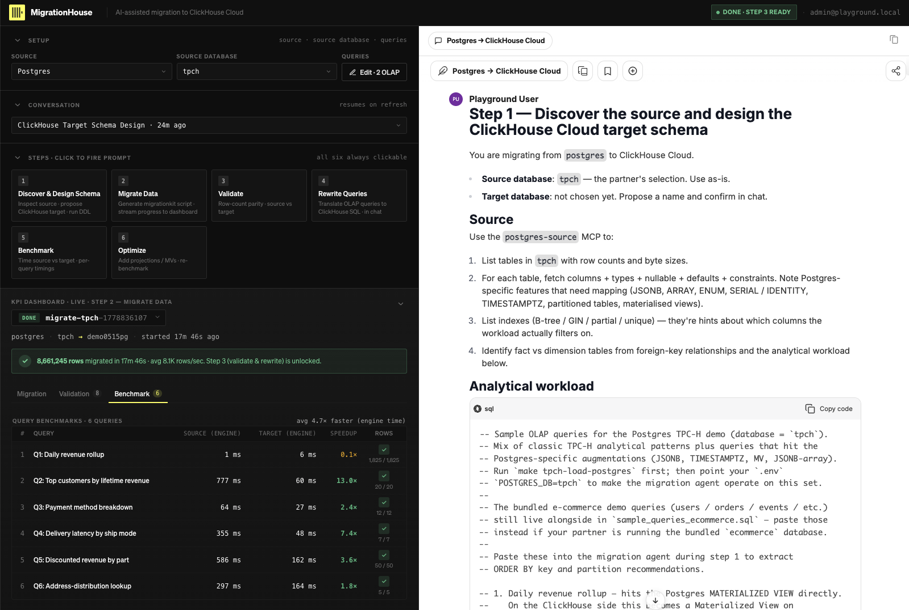
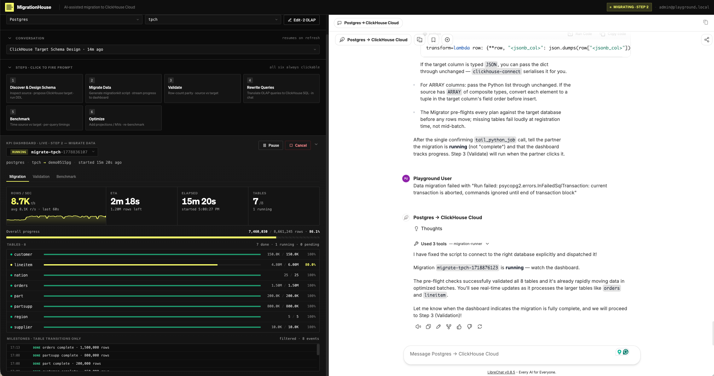

# MigrationHouse

**AI-assisted database migration to ClickHouse Cloud — run a real
migration end-to-end in under an hour.**



MigrationHouse is a self-contained Docker Compose playground that
turns the messy reality of database migration into a six-click
workflow. Pick a source (PostgreSQL, Snowflake, BigQuery, or
ClickHouse OSS), click each step on the dashboard, and watch an LLM
agent with live MCP connections do the work: introspect the source,
design a ClickHouse target schema, move the data, validate row
counts, rewrite analytical queries, and benchmark source vs target —
all on a real ClickHouse Cloud service you control.

## Why MigrationHouse

- **End-to-end, not a toy.** The agent reads your actual source
  schema, makes type-by-type decisions you can push back on
  (`Decimal` vs `Float`, `JSON` vs `String`, `Nullable(T)` vs
  `DEFAULT`), runs the DDL, moves data with batched inserts or
  object-storage staging, and benchmarks the result. By the end you
  have a working ClickHouse Cloud database, not a slide deck.
- **Grounded in ClickHouse best practices.** Every agent in
  MigrationHouse loads the official
  [**ClickHouse/agent-skills**](https://github.com/ClickHouse/agent-skills)
  knowledge pack as part of its system prompt — the same rules the
  ClickHouse team curates for LLM-driven schema design and query
  optimisation. The agent knows the canonical answers on engine
  choice (`MergeTree` vs `ReplicatedMergeTree` vs `SharedMergeTree`),
  `ORDER BY` key selection from real query patterns,
  `LowCardinality` vs `Enum` trade-offs, `Decimal` semantics for
  money, materialised-view design, codec selection, and the rest —
  not its training-data approximation of them. The skills are pulled
  in as a git submodule so updates ship with `git submodule update
  --remote`.
- **Source-agnostic in the same shape.** Four sources, one dashboard,
  one set of six step buttons. The agent and source MCP swap behind
  the scenes when you change the source dropdown — no setup juggling.
- **MCP-native.** Every database connection is exposed through an MCP
  server. The agent doesn't paste SQL into your terminal; it queries
  the source directly via the MCP and runs DDL on the target through
  a write-enabled `clickhousectl` MCP.
- **Bring your own keys.** Bring your own LLM API key (Anthropic /
  OpenAI / Google / Bedrock) and your own ClickHouse Cloud service.
  No vendor lock, no managed-only model.
- **Self-hostable and open-source.** Everything runs locally in
  Docker Compose. Extend it with your own source database — see
  [docs/adding-a-source.md](docs/adding-a-source.md) for the
  internals and the contributor walkthrough.

## Migration sources

| Source | Demo workload | Guide |
|---|---|---|
| **PostgreSQL → ClickHouse Cloud** | E-commerce platform + TPC-H option | [sources/postgres/GUIDE.md](sources/postgres/GUIDE.md) |
| **ClickHouse OSS → ClickHouse Cloud** | Web analytics platform + TPC-H option | [sources/clickhouse-oss/GUIDE.md](sources/clickhouse-oss/GUIDE.md) |
| **Snowflake → ClickHouse Cloud** | TPC-H + Snowflake-specific augmentations (VARIANT, TIMESTAMP_TZ, Stream, Dynamic Table, Clustering Key) | [sources/snowflake/GUIDE.md](sources/snowflake/GUIDE.md) |
| **BigQuery → ClickHouse Cloud** | TPC-H + BigQuery-specific augmentations (STRUCT, ARRAY<STRUCT>, partitioned + clustered tables, materialized view) | [sources/bigquery/GUIDE.md](sources/bigquery/GUIDE.md) |

## Prerequisites

- Docker Desktop 4.20+ (macOS/Windows) or Docker Engine + Docker
  Compose v2 (Linux) with at least 8 GB RAM
- `make`, `git`, `yq` (YAML processor used by `make setup`)
- An LLM API key (Anthropic Claude recommended, OpenAI / Gemini /
  Bedrock also work)
- A [ClickHouse Cloud](https://clickhouse.cloud) account with a
  running service
- 10 GB free disk space

## Quick Start

```bash
git clone https://github.com/sishuoyang/MigrationHouse
cd MigrationHouse
make setup            # initialises submodules, injects agent skills, creates .env
```

Edit `.env` and add your credentials:

```bash
ANTHROPIC_API_KEY=sk-ant-...                # or OPENAI_API_KEY / GOOGLE_KEY / Bedrock keys
CLICKHOUSE_CLOUD_HOST=<your-service>.clickhouse.cloud
CLICKHOUSE_CLOUD_USER=default
CLICKHOUSE_CLOUD_PASSWORD=<your-password>
```

```bash
make up
```

Open **<https://localhost/dashboard/>** in your browser (accept the
self-signed certificate warning). Sign in with
`admin@playground.local` / `playground`.

> **First run:** the bundled sources seed on startup — allow 5–10 min
> total. PostgreSQL: `docker compose logs postgres -f`. ClickHouse
> OSS: `docker compose logs clickhouse-oss -f`.

For Snowflake or BigQuery, run `make up-snowflake` or `make
up-bigquery` instead — both source MCPs are profile-gated because
they need account credentials in `.env` (see the per-source GUIDE for
the setup walkthrough).

## Using the MigrationHouse dashboard

You'll land on the **MigrationHouse** dashboard with the LibreChat
agent in the right pane.



The dashboard is laid out top-to-bottom as five regions. Each control
is described below.

### SETUP card

Three controls that determine which agent runs and what data it
operates on. Change them before clicking any step button.

- **Source dropdown** — `Postgres` / `Snowflake` / `BigQuery` /
  `ClickHouse OSS`. Switching the source **auto-switches the
  LibreChat agent** in the right pane to the matching pre-built agent
  (e.g. picking BigQuery selects the `BigQuery → ClickHouse Cloud`
  agent with its MCPs and system prompt). No agent toggling needed in
  LibreChat.
- **Source database dropdown** — the actual database / dataset /
  schema name on the source. For bundled workloads: `ecommerce`
  (Postgres) or `analytics` (ClickHouse OSS) or `migration_demo`
  (Snowflake / BigQuery). For TPC-H loaded via `make tpch-load-*`:
  `tpch`.
- **Edit · N OLAP button** — opens an editor for the analytical
  queries that drive step 1's `ORDER BY` design, step 4's query
  rewrite, and step 5's benchmark. `N` is how many queries are
  currently loaded.

### CONVERSATION card

- **Conversation picker** — every step you click creates (or resumes)
  a LibreChat conversation pinned to the active source. The current
  conversation's title and last-touched time appear here. Picking a
  past conversation from the dropdown loads it in the right pane.
- *resumes on refresh* — the dashboard remembers your last
  conversation; reloading the page returns you to it.

### STEPS · CLICK TO FIRE PROMPT card

Six buttons that drive the migration end-to-end. Each click fires the
corresponding `sources/<source>/prompts/0X-*.md` file as a chat prompt
and updates the dashboard's live state.

| # | Button | What it does | Watch on |
|---:|---|---|---|
| 1 | **Discover & Design Schema** | Agent introspects the source via the source MCP, reads OLAP queries, proposes ClickHouse schema, runs DDL. | Chat — review schema decisions |
| 2 | **Migrate Data** | Agent writes a `migrationkit` script, dispatches as a background job, stops. Data movement runs to completion. | Dashboard — Migration tab |
| 3 | **Validate** | Per-table row-count parity, source vs target. Stops on mismatch. | Dashboard — Validation tab |
| 4 | **Rewrite Queries** | Agent translates each OLAP query to ClickHouse SQL in chat. | Chat — review each rewrite |
| 5 | **Benchmark** | Per-query timing on both engines (server-side, not wall-clock). | Dashboard — Benchmark tab |
| 6 | **Optimize** | Agent proposes MVs / Projections / codec changes; iterate then re-fire step 5. | Chat + Benchmark tab |

*all six always clickable* — you can re-fire any step at any time
(e.g. re-run validation after fixing the schema). Steps don't strictly
have to be in order, though doing them out of order is rarely useful.

### KPI DASHBOARD card (LIVE)

Live progress for whichever step is most recently active. Header
reads `KPI DASHBOARD · LIVE · STEP N — <step name>`.

- **Run picker** — every fired step creates a `run_id` (e.g.
  `migrate-tpch-1778836107`). The picker shows the active run with
  its current status badge (`RUNNING` / `DONE` / `PAUSED` / `FAILED`
  / `CANCELLED`). Open the picker to switch back to any previous run
  on the same source.
- **Pause / Cancel buttons** — visible only when a run is `RUNNING`.
  Pause holds the run mid-batch (resume from the same point). Cancel
  terminates it irrecoverably.
- **Run details line** — `<source> · <source-db> → <target-db> ·
  started <relative time>`. Confirms the run's parameters at a
  glance.
- **Tab bar** — three views over the same run:
  - **Migration** (default): KPI tiles (`ROWS / SEC` with live
    sparkline, `ETA`, `ELAPSED`, `TABLES`), overall progress bar
    (absolute + percentage), per-table progress bars with row counts
    and percentages, and a milestone feed (table-transition events
    with timestamps).
  - **Validation**: one row per table — `source rows` / `target rows`
    / `matched`. Populated after step 3.
  - **Benchmark**: one row per query — `source ms` / `target ms` /
    `speedup`. Populated after step 5.

### Right pane — LibreChat

- **Conversation header** — the active agent's name and copy /
  bookmark / `+` (new conversation) icons. Use `+` to start fresh if
  the conversation has drifted.
- **Agent message thread** — the agent's reasoning, tool calls
  (collapsed by default — click to expand), and replies. Push back
  here when a decision looks wrong; the agent should reason, not just
  produce.
- **Message input** — for free-form chat. The six step buttons cover
  the canonical flow; the message input is for clarifications,
  pushback, and off-script questions.

## Where to go next

- **Run a migration end-to-end** — follow the per-source guide:
  [Postgres](sources/postgres/GUIDE.md) ·
  [Snowflake](sources/snowflake/GUIDE.md) ·
  [BigQuery](sources/bigquery/GUIDE.md) ·
  [ClickHouse OSS](sources/clickhouse-oss/GUIDE.md).
- **Add your own source database** —
  [docs/adding-a-source.md](docs/adding-a-source.md) explains the
  internals (architecture diagram, `migration-runner` and
  `migration-dashboard` deep dives) and walks through extending the
  playground with a new source.
- **Customise the agent's system prompt** — see the *Customising the
  agent system prompt* section of
  [docs/adding-a-source.md](docs/adding-a-source.md).

## Common commands

```bash
make setup               # first-time setup (submodules + agent skills + .env)
make up                  # start the playground (Postgres + ClickHouse OSS sources)
make up-snowflake        # also start the Snowflake source MCP (needs SNOWFLAKE_* in .env)
make up-bigquery         # also start the BigQuery source MCP (needs BIGQUERY_* in .env)
make down                # stop without removing data
make reset               # destroy volumes and start fresh
make reset-agent         # delete + recreate the four pre-built agents (after model/provider changes)
```

The full command list lives in the [Makefile](Makefile); see the
[adding-a-source guide](docs/adding-a-source.md#operational-commands)
for the operational reference.

## Default credentials

| Service | Detail |
|---|---|
| Dashboard URL | `https://localhost/dashboard/` |
| LibreChat login | `admin@playground.local` / `playground` |
| ClickHouse Cloud | credentials from `.env` (`CLICKHOUSE_CLOUD_HOST/USER/PASSWORD`) |

Per-source database credentials (Postgres, ClickHouse OSS) live in
each per-source GUIDE — you rarely need them outside the agent path.

## License

Apache 2.0. Forks, PRs, and source contributions welcome — see
[docs/adding-a-source.md](docs/adding-a-source.md).
