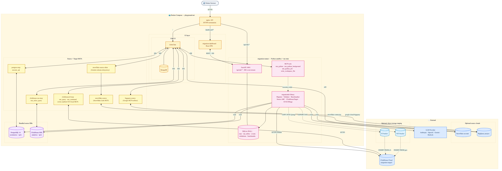

# AI Migration Assistant

A self-contained Docker Compose environment for hands-on AI-assisted database migration to ClickHouse Cloud. Partners use a chat interface backed by real MCP database connections to work through schema analysis, data migration, query rewriting, and performance optimisation — all with AI guidance.



> To regenerate the diagram after editing `docs/architecture.mmd`: `make diagram`

## Migration Sources

Two independent migration scenarios are included — each with its own dataset, guide, and agent system prompt:

| Source | Dataset | Guide |
|---|---|---|
| **PostgreSQL → ClickHouse Cloud** | E-commerce platform (orders, events, sessions) | [sources/postgres/GUIDE.md](sources/postgres/GUIDE.md) |
| **ClickHouse OSS → ClickHouse Cloud** | Web analytics platform (pageviews, sessions, conversions) | [sources/clickhouse-oss/GUIDE.md](sources/clickhouse-oss/GUIDE.md) |

Want to contribute a new dataset or database engine? See **[docs/adding-a-source.md](docs/adding-a-source.md)**.

## What's included

**Local Docker Compose**
| Component | Purpose |
|---|---|
| PostgreSQL 16 | Source DB — pre-loaded e-commerce OLAP dataset |
| Postgres MCP server | Gives the AI agent full access to the Postgres source |
| ClickHouse OSS | Source DB — pre-loaded web analytics OLAP dataset |
| ClickHouse OSS MCP server | Gives the AI agent full access to the ClickHouse OSS source |
| LibreChat | Provider-agnostic chat UI — bring your own API key |

The below components are part of the **ClickHouse Cloud**
| Component | Purpose |
|---|---|
| ClickHouse Cloud | Target DB — your Cloud service, ready for migration |
| ClickHouse Cloud MCP | Gives the AI agent read access to ClickHouse Cloud |
| ClickHouse Docs MCP | Lets the agent search ClickHouse docs on the fly |

## Prerequisites

- Docker Desktop 4.20+ (macOS/Windows) or Docker Engine + Docker Compose v2 (Linux) with at least 8 GB RAM
- `make` — pre-installed on macOS; on Debian/Ubuntu: `sudo apt-get install -y make`
- `git` — pre-installed on most systems; on Debian/Ubuntu: `sudo apt-get install -y git`
- `yq` — YAML processor used by `make setup`; on Debian/Ubuntu: `sudo snap install yq` or `sudo wget https://github.com/mikefarah/yq/releases/latest/download/yq_linux_amd64 -O /usr/local/bin/yq && sudo chmod +x /usr/local/bin/yq`
- An LLM API key (Anthropic Claude recommended, OpenAI also works)
- A [ClickHouse Cloud](https://clickhouse.cloud) account with a running service
- 10 GB free disk space


## Quick Start

```bash
git clone https://github.com/sishuoyang/ai-migration-assistant
cd ai-migration-assistant
make setup          # initialises submodules, injects agent skills, creates .env
```

Edit `.env` and add your LLM API key:
```bash
ANTHROPIC_API_KEY=sk-ant-...        # or OPENAI_API_KEY=sk-...
```

```bash
make up
```

Open **http://localhost:3080** in your browser.

> **First run:** Both databases seed on startup — allow 5–10 minutes total.
> - PostgreSQL generates ~10M rows (`DATASET_SIZE=medium`): `docker compose logs postgres -f`
> - ClickHouse OSS loads ~12.2M rows (fixed): `docker compose logs clickhouse-oss -f`

## Default credentials

| Service | Detail |
|---|---|
| LibreChat login | `admin@playground.local` / `playground` |
| Postgres host (internal) | `postgres:5432` |
| Postgres database | `ecommerce` |
| Postgres user / password | `playground` / `playground` |
| ClickHouse OSS host (internal) | `clickhouse-oss:8123` |
| ClickHouse OSS host (local) | `localhost:8123` |
| ClickHouse OSS user / password | `default` / *(empty)* |
| ClickHouse OSS database | `analytics` |
| ClickHouse Cloud | OAuth via browser — no local password needed |

## Using the playground

1. Sign in at **http://localhost:3080** with `admin@playground.local` / `playground`
2. **Select a model** from the dropdown in the top bar — choose Claude, Gemini, or GPT-4. The agent will not respond correctly until a model is explicitly selected.
3. **Enable MCP servers** by clicking the MCP icon in the chat toolbar. This step is required — the agent's migration knowledge (system prompt) is only injected when the MCP servers are active. Enable the servers for your chosen migration source:

   **PostgreSQL → ClickHouse Cloud:**
   - `postgres-source` — source Postgres database
   - `clickhousectl` — ClickHouse Cloud (read + write, DDL + INSERT)
   - `clickhouse-docs` — ClickHouse documentation

   **ClickHouse OSS → ClickHouse Cloud:**
   - `clickhouse-oss-source` — source ClickHouse OSS database
   - `clickhousectl` — ClickHouse Cloud (read + write, DDL + INSERT)
   - `clickhouse-docs` — ClickHouse documentation

4. Follow the guide for your chosen source:
   - **Postgres:** [sources/postgres/GUIDE.md](sources/postgres/GUIDE.md)
   - **ClickHouse OSS:** [sources/clickhouse-oss/GUIDE.md](sources/clickhouse-oss/GUIDE.md)
5. Use the copy-paste prompts in the corresponding `prompts/` directory for each phase

## Dataset sizes

### PostgreSQL source (configurable)

| Size | Events | Seed time | RAM needed |
|---|---|---|---|
| `small` | 1M | ~1 min | 4 GB |
| `medium` (default) | 10M | 5–10 min | 8 GB |
| `large` | 30M | 20–30 min | 16 GB |

Set `DATASET_SIZE=small` in `.env` for faster startup on low-spec machines.

### ClickHouse OSS source (fixed)

| Table | Rows |
|---|---|
| `analytics.projects` | 1,000 |
| `analytics.sessions` | 2,000,000 |
| `analytics.pageviews` | 10,000,000 |
| `analytics.conversions` | 200,000 |
| `analytics.daily_stats` | pre-aggregated from sessions |

Seed time: ~3–5 minutes on first run.

## Enable LLM Tracing with Langfuse (optional)

LibreChat has native Langfuse support — add three lines to `.env` to get token usage,
latency, and full conversation traces for every AI interaction in the playground.

1. Sign up free at [cloud.langfuse.com](https://cloud.langfuse.com) → **Settings → API Keys**
2. Add to `.env`:
```bash
LANGFUSE_PUBLIC_KEY=pk-lf-...
LANGFUSE_SECRET_KEY=sk-lf-...
LANGFUSE_BASE_URL=https://cloud.langfuse.com
```
3. `docker compose restart librechat`

## Customising the Agent System Prompt

The agent's behaviour is controlled by a set of modular instruction files:

| File | Purpose |
|---|---|
| [librechat/clickhouse-cloud-instructions.md](librechat/clickhouse-cloud-instructions.md) | Base rules applied to all migration sources |
| [librechat/sources/postgres-instructions.md](librechat/sources/postgres-instructions.md) | Postgres-specific migration rules |
| [librechat/sources/clickhouse-oss-instructions.md](librechat/sources/clickhouse-oss-instructions.md) | ClickHouse OSS-specific migration rules |

All files are combined with the ClickHouse best practices from `agent-skills/` and injected into `librechat/librechat.yaml` on every `make setup` run. The `serverInstructions` field in `librechat.yaml` is a build artifact — do not edit it directly.

**To add a new migration source:** see **[docs/adding-a-source.md](docs/adding-a-source.md)** for the full walkthrough — Docker service, MCP wiring, and system prompt authoring.

**To apply changes:**
```bash
# 1. Edit the instruction file(s)
$EDITOR librechat/sources/clickhouse-oss-instructions.md

# 2. Rebuild and inject into librechat.yaml
make setup

# 3. Reload the agent
docker compose restart librechat
```

## Commands

```bash
make setup     # first-time setup (submodules + agent skills + .env)
make up        # start the playground
make down      # stop without removing data
make reset     # destroy volumes and start fresh
make health    # check all services are healthy
make logs      # tail all service logs
make diagram   # regenerate docs/architecture.png from docs/architecture.mmd
```

## Troubleshooting

**MCP servers not showing in LibreChat:**
Verify `interface.mcpServers.use: true` is set in `librechat/librechat.yaml`.

**Postgres seed takes too long:**
Set `DATASET_SIZE=small` in `.env`, run `make reset`.

**Out of memory during seed:**
Increase Docker Desktop memory to 8+ GB (Docker Desktop → Settings → Resources).

**ClickHouse Cloud MCP OAuth fails with "No route matches URL /oauth/undefined/login":**
`DOMAIN_CLIENT` and `DOMAIN_SERVER` are not set. LibreChat needs these to build the OAuth callback URL. Add them to `.env`:
```
DOMAIN_CLIENT=http://<your-host>:3080
DOMAIN_SERVER=http://<your-host>:3080
```
Use `http://localhost:3080` for local installs, or your server's public IP/hostname for remote deployments. Then restart: `docker compose restart librechat`.

**ClickHouse Cloud MCP not connecting / OAuth not working:**
Ensure the remote MCP server is enabled for your service: ClickHouse Cloud console → service → **Connect** → **MCP** → toggle on. Then restart LibreChat: `docker compose restart librechat`.

**ClickHouse OSS MCP (`clickhouse-oss-source`) not appearing:**
The MCP server uses `npx` on first start and may take 30–60 seconds to download packages.
Check logs: `docker compose logs clickhouse-oss-mcp -f`. If it fails, restart:
`docker compose restart clickhouse-oss-mcp`.

**ClickHouse OSS seed taking longer than expected:**
The init SQL loads 12.2M rows using `numbers()` — this is compute-bound, not I/O-bound.
On slower machines allow up to 10 minutes: `docker compose logs clickhouse-oss -f`.
